# 📊 Ultimate Notion Track Architecture — Master In-Depth Flowcharts Guide

> **All-in-One Visual Blueprint**: Every phase, component, edge-case, state machine, and data pipeline in the Notion Track explained **in complete depth exclusively through Flowcharts and Visual Diagrams**.

---

## 📑 Master Table of Contents
1. [⚡ Section 1: The Macro System Flow](#1-⚡-section-1-the-macro-system-flow)
2. [📥 Section 2: Ingestion & Trigger Pipeline](#2-📥-section-2-ingestion--trigger-pipeline)
3. [🛡️ Section 3: Data Sanitization, Validation & Deduplication](#3-🛡️-section-3-data-sanitization-validation--deduplication)
4. [🧠 Section 4: AI Extraction & Classification Engine](#4-🧠-section-4-ai-extraction--classification-engine)
5. [🗄️ Section 5: Notion Data Models & State Machine](#5-🗄️-section-5-notion-data-models--state-machine)
6. [🙋 Section 6: Human-in-the-Loop (HITL) Decision Tree](#6-🙋-section-6-human-in-the-loop-hitl-decision-tree)
7. [⚙️ Section 7: Notion Sync & Background Worker Engine](#7-⚙️-section-7-notion-sync--background-worker-engine)
8. [🌍 Section 8: Real-World Action Execution Pipeline](#8-🌍-section-8-real-world-action-execution-pipeline)
9. [📜 Section 9: Automated Tamper-Proof Audit & Run Log Pipeline](#9-📜-section-9-automated-tamper-proof-audit--run-log-pipeline)
10. [🚨 Section 10: Fault-Tolerance, Retries & Dead-Letter Escalation](#10-🚨-section-10-fault-tolerance-retries--dead-letter-escalation)
11. [⚖️ Section 11: Hackathon Judging "Kill Test" & Evaluation Tree](#11-⚖️-section-11-hackathon-judging-kill-test--evaluation-tree)
12. [🌐 Section 12: The Grand End-to-End Master State Flowchart](#12-🌐-section-12-the-grand-end-to-end-master-state-flowchart)

---

## 1. ⚡ Section 1: The Macro System Flow

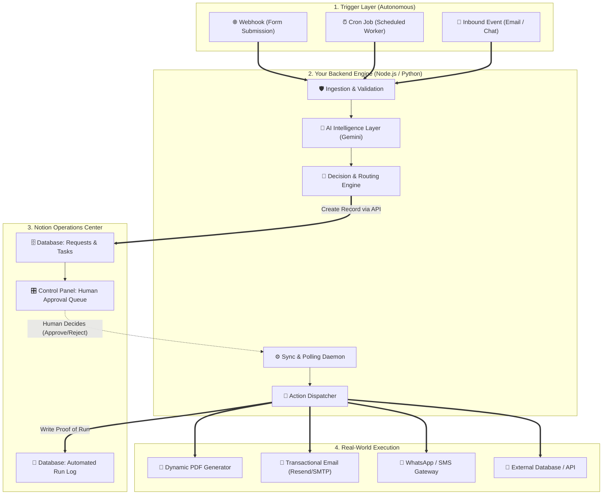

---

## 2. 📥 Section 2: Ingestion & Trigger Pipeline

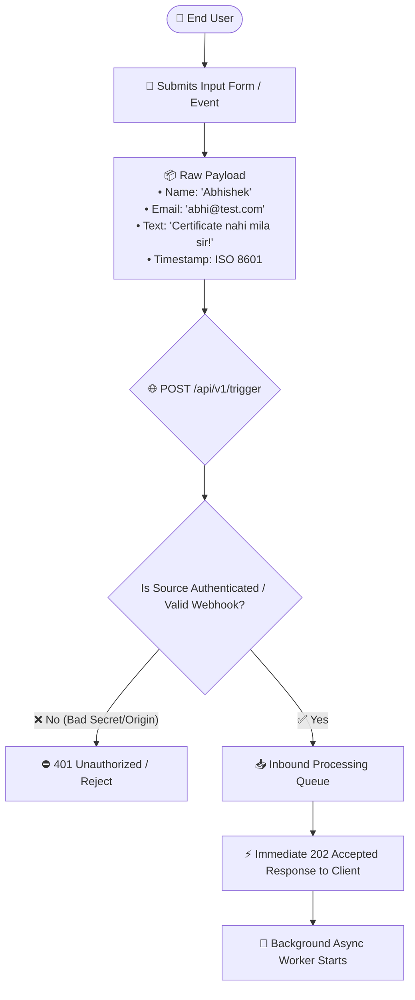

---

## 3. 🛡️ Section 3: Data Sanitization, Validation & Deduplication

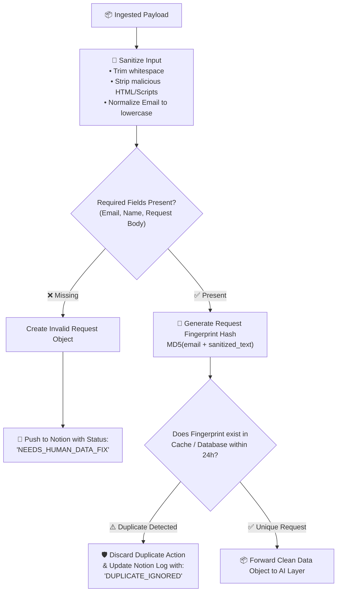

---

## 4. 🧠 Section 4: AI Extraction & Classification Engine

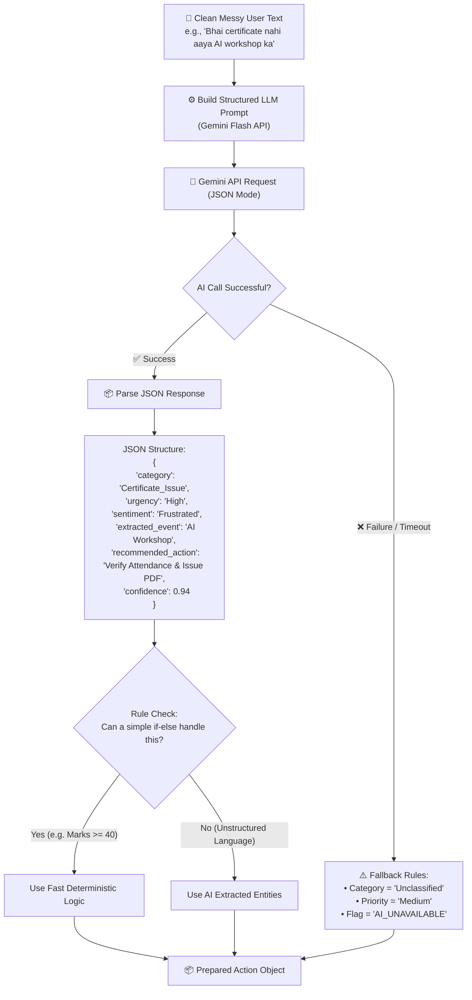

---

## 5. 🗄️ Section 5: Notion Data Models & State Machine

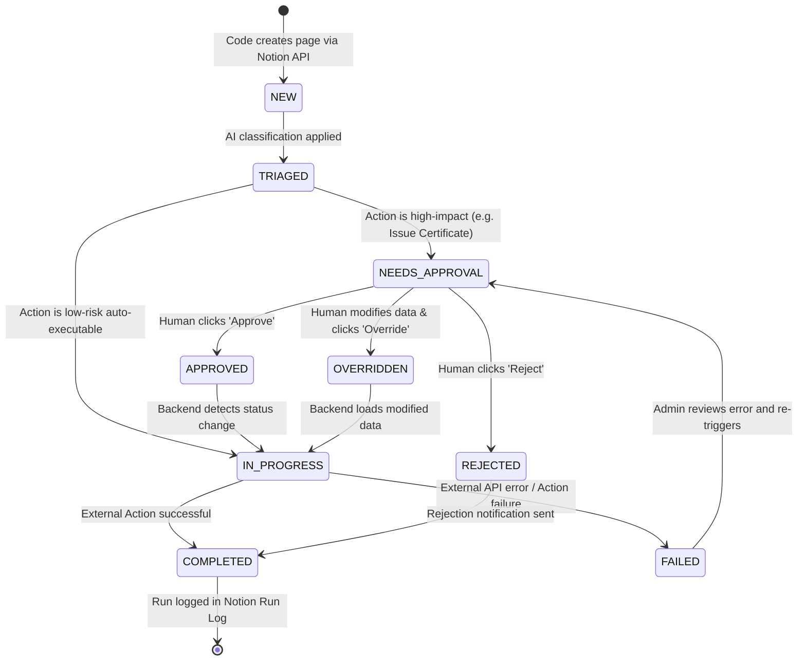

---

## 6. 🙋 Section 6: Human-in-the-Loop (HITL) Decision Tree

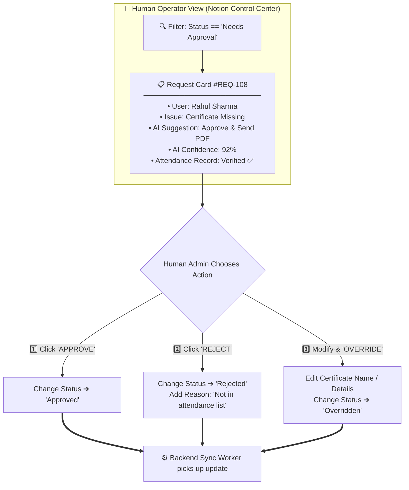

---

## 7. ⚙️ Section 7: Notion Sync & Background Worker Engine

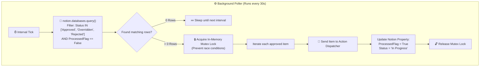

---

## 8. 🌍 Section 8: Real-World Action Execution Pipeline

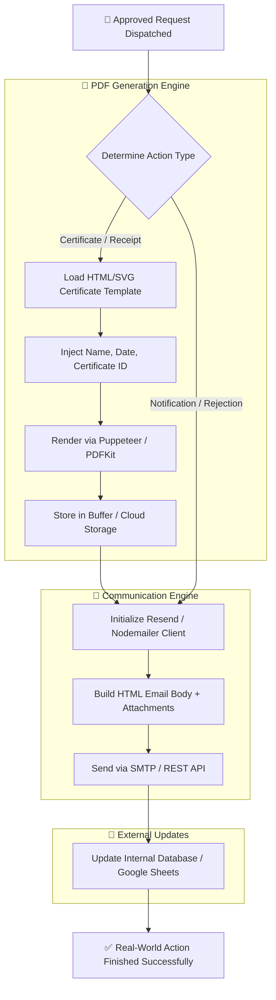

---

## 9. 📜 Section 9: Automated Tamper-Proof Audit & Run Log Pipeline

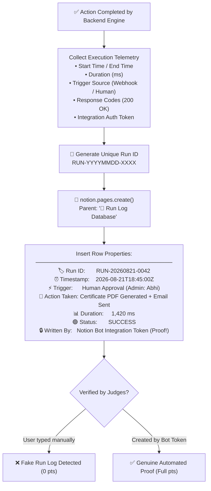

---

## 10. 🚨 Section 10: Fault-Tolerance, Retries & Dead-Letter Escalation

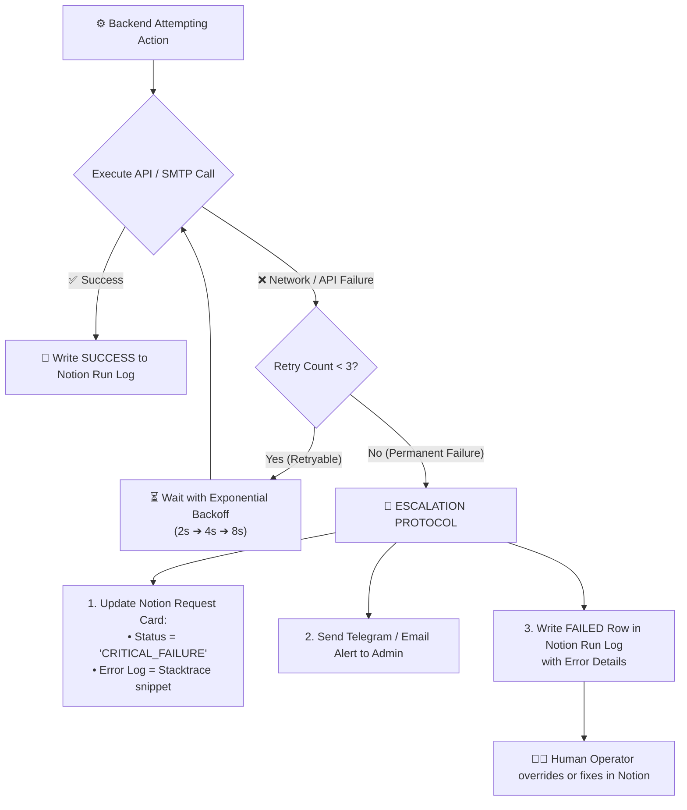

---

## 11. ⚖️ Section 11: Hackathon Judging "Kill Test" & Evaluation Tree

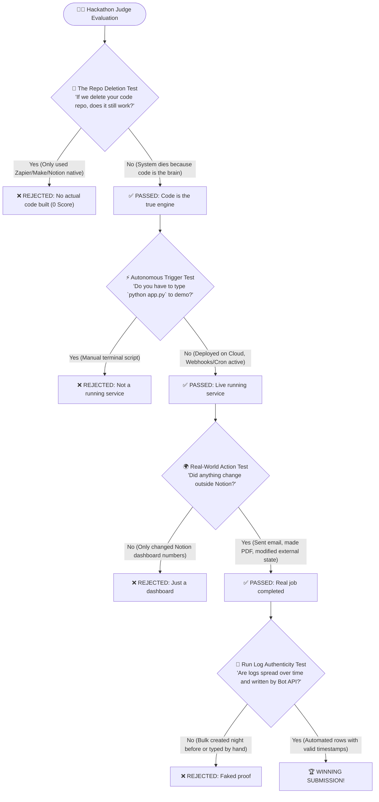

---

## 12. 🌐 Section 12: The Grand End-to-End Master State Flowchart

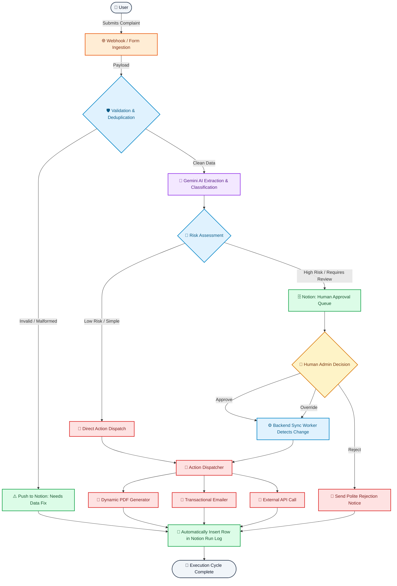
