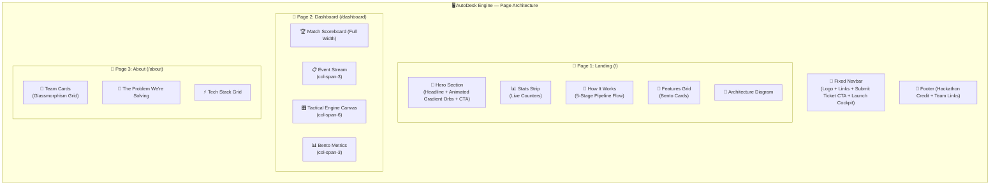

# 📐 UI Design & Layout Specification — AutoDesk Engine

> **Design Theme**: Deep OLED Void / Pitch Black — High-precision, mathematical dark UI.  
> **Domain**: Autonomous Certificate Request Automation & Human-in-the-Loop Backend (HITL Pipeline).


---

## 📑 Table of Contents
1. [🎨 Visual Identity & Color Palette](#1-🎨-visual-identity--color-palette)
2. [📐 Wireframe & Page Layout Architecture](#2-📐-wireframe--page-layout-architecture)
3. [🧱 Component Breakdown](#3-🧱-component-breakdown)
   - [A. Shared Components](#a-shared-components)
   - [B. Landing Page Components](#b-landing-page-components)
   - [C. Dashboard Cockpit Components](#c-dashboard-cockpit-components)
   - [D. About Page Components](#d-about-page-components)
4. [✨ Surfaces, Texture & Glassmorphism Tokens](#4-✨-surfaces-texture--glassmorphism-tokens)
5. [💻 Design System CSS Tokens (Copy-Paste Ready)](#5-💻-design-system-css-tokens-copy-paste-ready)

## Current Feature Set

The implemented experience includes a landing-page submission modal, animated pipeline and feature sections, an About page, and a live tactical cockpit. The cockpit provides event filtering, request inspection, confidence and priority display, clean/garbage webhook simulation, approve/reject controls, counters, and recent run-log telemetry. The backend actions behind these controls are `ingest`, `approve`, and `reject`.

---

## 1. 🎨 Visual Identity & Color Palette (Deep OLED Void)

| Token | Hex / RGBA | Preview / Purpose | Description |
| :--- | :--- | :--- | :--- |
| `--bg-canvas` | `#050508` | ⬛ Deep OLED Pitch Black | Primary application background (Void) |
| `--bg-panel` | `#0a0c10` | ◼️ Obsidian Matte Panel | Non-reflective panel background |
| `--bg-panel-elevated` | `#10141d` | ◾ Elevated Void Card | Floating container surface |
| `--border-subtle` | `rgba(255, 255, 255, 0.06)` | ▫️ 1px Ultra-thin outline | Crisp mathematical boundary |
| `--text-gold` | `#ffd700` | 🟡 Gold | Primary glow headings & accents |
| `--text-primary` | `#f3f4f6` | ⚪ Stark White | Body text & values |
| `--text-secondary` | `#8b949e` | 🔘 Ash-Gray | Muted metric labels & units |
| `--accent-cyan` | `#00e5ff` | 🔷 Electric Cyan | Primary actions & pipeline baseline |
| `--accent-amber` | `#ffb300` | 🔶 Amber Gold | Warnings & Human Review flags |
| `--accent-crimson` | `#ff2a55` | 🔴 Crimson Red | Critical alerts & error states |
| `--accent-emerald` | `#00e676` | 🟢 Emerald Green | Verified attendance & success |
| `--accent-violet` | `#7c4dff` | 🟣 Violet Pulse | AI classification & tags |
| `--accent-orange` | `#ff6e40` | 🟠 Blaze Orange | CTA highlights & badges |
| `--grid-dot` | `rgba(255, 255, 255, 0.04)` | ◽ Dot-matrix coordinate grid | Background mathematical grid |

---

## 2. 📐 Wireframe & Page Layout Architecture

### Three-Page Application Structure

```
┌────────────────────────────────────────────────────────────────────────────────────┐
│ 🧭 FIXED TOP NAVBAR (glass + backdrop-blur)                                       │
│ [⚡ AutoDesk Engine Logo]  [Home]  [Dashboard LIVE]  [About]  [Submit Ticket] [CTA]│
├────────────────────────────────────────────────────────────────────────────────────┤
│                                                                                    │
│  PAGE 1: /           PAGE 2: /dashboard           PAGE 3: /about                   │
│  Landing Page        Live Tactical Cockpit        Team & Tech Stack                │
│                                                                                    │
└────────────────────────────────────────────────────────────────────────────────────┘
```

### Dashboard Cockpit Wireframe (12-Column Grid)

```
┌──────────────────────────────────────────────────────────────────────────────────┐
│  MATCH SCOREBOARD — Live Telemetry Header (full width)                           │
│  [Request ID] [Category] [Confidence] [Status Badge] [Stats: Completed/Pending]  │
├─────────────────┬────────────────────────────────┬───────────────────────────────┤
│ COL 1 (3/12)    │ COL 2 (6/12)                   │ COL 3 (3/12)                  │
│                 │                                │                               │
│ 📋 EVENT STREAM │ 🎛️ TACTICAL ENGINE CANVAS       │ 📊 BENTO METRICS              │
│ TIMELINE        │                                │                               │
│                 │ • AI Classification Display    │ • Completed / Pending / Total  │
│ • Filter Tabs   │ • Raw Message Inspector       │ • Pipeline Run Logs            │
│   (ALL/PENDING/ │ • Confidence & Priority        │ • Recent Execution History     │
│    SUCCESS/FIX) │ • Approve / Reject Buttons     │                               │
│ • Event Cards   │ • Simulate Webhook Controls    │                               │
│ • Click to      │   (Clean + Garbage Input)      │                               │
│   select        │                                │                               │
│                 │                                │                               │
└─────────────────┴────────────────────────────────┴───────────────────────────────┘
```



---

## 3. 🧱 Component Breakdown

### A. Shared Components

| Component | File | Purpose |
|:----------|:-----|:--------|
| `Navbar` | `components/Navbar.jsx` | Fixed top nav with glassmorphism, logo, nav links (Home, Dashboard with LIVE badge, About), Submit Ticket button, Launch Cockpit CTA. Mobile hamburger menu with AnimatePresence. |
| `SubmitRequestModal` | `components/SubmitRequestModal.jsx` | Interactive modal triggered from Navbar + Hero. Student fills name, email, raw message. Calls `/api/pipeline` with `action: "ingest"`. Shows AI classification results, Notion sync status, and email dispatch status on success. Includes quick-fill test presets. |
| `Footer` | `components/Footer.jsx` | Project name, hackathon credit, team links. |

### B. Landing Page Components (`/`)

| Component | File | Purpose |
|:----------|:-----|:--------|
| `Hero` | `components/Hero.jsx` | Full-viewport hero with animated floating orbs (cyan, amber, violet, crimson). Bold headline "Kill One Boring Job. Completely." with gradient text. Two CTAs: "Submit Live Ticket" (opens modal) + "Open Live Cockpit" (links to dashboard). Bottom formula strip showing pipeline flow. |
| `StatsStrip` | `components/StatsStrip.jsx` | Horizontal strip with live counters: Requests Processed, Uptime, Certificates Sent, Response Time. |
| `HowItWorks` | `components/HowItWorks.jsx` | 5-stage pipeline visualization: Ingest → Classify → Approve → Execute → Audit. Each step with icon and description. |
| `Features` | `components/Features.jsx` | Bento-style grid cards: AI Classification, HITL, Real-World Actions, Tamper-Proof Logs. Cards use animated reveal and hover states. |
| `Architecture` | `components/Architecture.jsx` | Visual system architecture diagram showing full pipeline flow. |

### C. Dashboard Cockpit Components (`/dashboard`)

Layout: 12-column CSS grid with `grid-cols-12`, split as 3/6/3.

| Component | File | Grid Position | Purpose |
|:----------|:-----|:-------------|:--------|
| `MatchScoreboard` | `components/dashboard/MatchScoreboard.jsx` | Full width (above grid) | Live telemetry header showing active event details: request ID, category, confidence, status, completion stats. |
| `EventStreamTimeline` | `components/dashboard/EventStreamTimeline.jsx` | `col-span-3` (left) | Scrollable list of all pipeline events. Filter tabs (ALL, PENDING, SUCCESS, NEEDS_FIX). Click to select and inspect in the tactical canvas. Each card shows ID, time, user, category, confidence, status badge. |
| `TacticalEngineCanvas` | `components/dashboard/TacticalEngineCanvas.jsx` | `col-span-6` (center) | Main interaction area. Displays selected event's AI classification, raw message, extracted metadata, confidence gauge, priority, and action preview. **Approve** and **Reject** buttons trigger live `/api/pipeline` calls. **Simulate Webhook** buttons for testing clean and garbage inputs. |
| `BentoMetrics` | `components/dashboard/BentoMetrics.jsx` | `col-span-3` (right) | Bento-style metric cards: Completed count, Pending count, Total logged. Pipeline run log table with recent execution history (Run ID, timestamp, action, trigger, duration, status). |

### D. About Page Components (`/about`)

| Component | File | Purpose |
|:----------|:-----|:--------|
| `TeamCard` | `components/TeamCard.jsx` | Glassmorphism team member cards with name, role, bio, and social links (GitHub, LinkedIn). Staggered entrance animation. |
| `TechStack` | `components/TechStack.jsx` | Animated grid of technologies used by the application, including Next.js, Tailwind CSS, Framer Motion, Gemini AI, Notion API, Resend, and SMTP support. |

---

## 4. ✨ Surfaces, Texture & Glassmorphism Tokens

```
┌────────────────────────────────────────────────────────────────┐
│ 🌫️ FROSTED GLASS NAVBAR / TOOLTIP OVERLAY                      │
│ Background: rgba(10, 12, 16, 0.75)                             │
│ Border: 1px solid rgba(255, 255, 255, 0.08)                    │
│ Backdrop-filter: blur(16px) saturate(180%)                     │
│ Box-shadow: 0 8px 32px 0 rgba(0, 0, 0, 0.6)                    │
└────────────────────────────────────────────────────────────────┘
```

* **Dot-Matrix Grid Texture** (`.dot-grid` class):
  ```css
  background-image: 
    radial-gradient(rgba(255, 255, 255, 0.04) 1px, transparent 1px);
  background-size: 20px 20px;
  ```

* **Floating Gradient Orbs** (`.orb` class):
  - Absolutely positioned, `filter: blur(80px)`, `opacity: 0.3`
  - Variants: `.orb-cyan`, `.orb-amber`, `.orb-crimson`, `.orb-violet`
  - Animated via `float` (6s), `float-slow` (8s), `pulse-glow` (4s)

* **Glass Card** (`.glass-card` class):
  - `background: rgba(10, 12, 16, 0.65)`
  - `border: 1px solid rgba(255, 255, 255, 0.07)`
  - `backdrop-filter: blur(20px) saturate(160%)`

---

## 5. 💻 Design System CSS Tokens (Copy-Paste Ready)

```css
:root {
  /* Surface Colors (Deep OLED Void) */
  --bg-canvas: #050508;
  --bg-panel: #0a0c10;
  --bg-panel-elevated: #10141d;
  --bg-card-hover: #161c28;
  --bg-surface-active: #1e2638;
  --bg-glass: rgba(10, 12, 16, 0.75);

  /* Borders & Grids */
  --border-subtle: rgba(255, 255, 255, 0.06);
  --border-active: rgba(0, 229, 255, 0.40);
  --border-hover: rgba(255, 255, 255, 0.14);

  /* Precision Data Accents */
  --accent-cyan: #00e5ff;
  --accent-amber: #ffb300;
  --accent-crimson: #ff2a55;
  --accent-emerald: #00e676;
  --accent-violet: #7c4dff;
  --accent-orange: #ff6e40;

  /* Typography */
  --text-gold: #ffd700;
  --text-white: #f3f4f6;
  --text-secondary: #8b949e;
  --text-muted: #545d68;
  --font-sans: 'Inter', ui-sans-serif, system-ui, sans-serif;
  --font-mono: 'JetBrains Mono', ui-monospace, monospace;

  /* Glassmorphism & Shadows */
  --glass-blur: blur(14px);
  --panel-shadow: 0 12px 36px rgba(0, 0, 0, 0.45);
}
```

### Tailwind v4 Theme Integration (via `@theme inline` in `globals.css`)

```css
@theme inline {
  --color-canvas: var(--bg-canvas);
  --color-panel: var(--bg-panel);
  --color-panel-elevated: var(--bg-panel-elevated);
  --color-card-hover: var(--bg-card-hover);
  --color-surface-active: var(--bg-surface-active);

  --color-cyan-accent: var(--accent-cyan);
  --color-amber-accent: var(--accent-amber);
  --color-crimson-accent: var(--accent-crimson);
  --color-emerald-accent: var(--accent-emerald);
  --color-violet-accent: var(--accent-violet);
  --color-orange-accent: var(--accent-orange);

  --color-gold: var(--text-gold);
  --color-text-white: var(--text-white);
  --color-text-secondary: var(--text-secondary);
  --color-text-muted: var(--text-muted);

  --color-border-subtle: var(--border-subtle);
  --color-border-active: var(--border-active);

  --font-sans: 'Inter', ui-sans-serif, system-ui, sans-serif;
  --font-mono: 'JetBrains Mono', ui-monospace, monospace;
}
```
