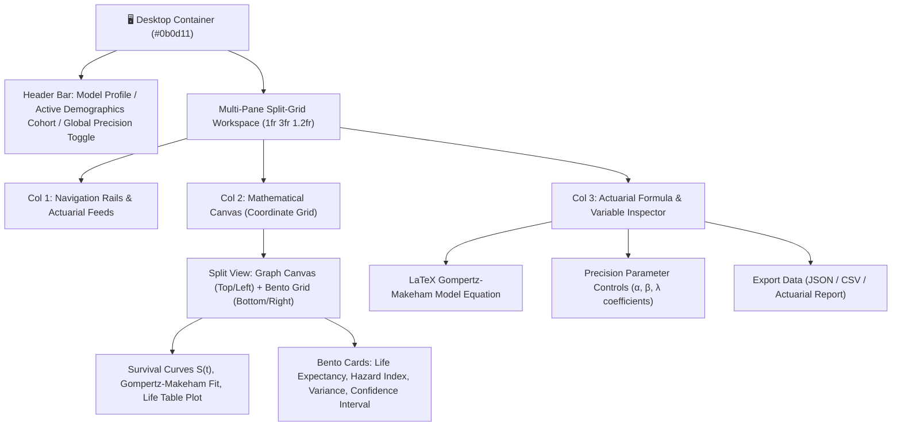

# 📐 UI Design & Layout Specification — AutoDesk Engine

> **Design Theme**: High-precision, mathematical elegance styled in the vein of Matiks.  
> **Domain**: Autonomous Certificate Request Automation & Human-in-the-Loop Backend (HITL Pipeline).


---

## 📑 Table of Contents
1. [🎨 Visual Identity & Color Palette](#1-🎨-visual-identity--color-palette)
2. [📐 Wireframe & Multi-Pane Workspace Layout](#2-📐-wireframe--multi-pane-workspace-layout)
3. [🧱 Layout Hierarchy & Surface Architecture](#3-🧱-layout-hierarchy--surface-architecture)
4. [📊 Component Breakdown](#4-📊-component-breakdown)
   - [A. Slim Collapsible Left Navigation Sidebar](#a-slim-collapsible-left-navigation-sidebar)
   - [B. Central Split-Canvas: Interactive Survival Curves](#b-central-split-canvas-interactive-survival-curves)
   - [C. Modular Bento Metric Grid](#c-modular-bento-metric-grid)
   - [D. Right Contextual Formula & Variable Inspector](#d-right-contextual-formula--variable-inspector)
5. [✨ Surfaces, Texture & Glassmorphism Tokens](#5-✨-surfaces-texture--glassmorphism-tokens)
6. [💻 Design System CSS Tokens (Copy-Paste Ready)](#6-💻-design-system-css-tokens-copy-paste-ready)

---

## 1. 🎨 Visual Identity & Color Palette (Deep OLED Void)

| Token | Hex / RGBA | Preview / Purpose | Description |
| :--- | :--- | :--- | :--- |
| `--bg-canvas` | `#050508` | ⬛ Deep OLED Pitch Black | Primary application background (Void) |
| `--bg-panel` | `#0a0c10` | ◼️ Obsidian Matte Panel | Non-reflective panel background |
| `--bg-panel-elevated` | `#10141d` | ◾ Elevated Void Card | Floating container surface |
| `--border-subtle` | `rgba(255, 255, 255, 0.06)` | ▫️ 1px Ultra-thin outline | Crisp mathematical boundary |
| `--text-primary` | `#f3f4f6` | ⚪ Stark White | Primary headings & values |
| `--text-secondary` | `#8b949e` | 🔘 Ash-Gray | Muted metric labels & units |
| `--accent-cyan` | `#00e5ff` | 🔷 Electric Cyan | Safe probability & curve baseline |
| `--accent-amber` | `#ffb300` | 🔶 Amber Gold | Elevated risk factor thresholds |
| `--accent-crimson` | `#ff2a55` | 🔴 Crimson Red | Critical hazard rates ($\mu_x$) |
| `--grid-dot` | `rgba(255, 255, 255, 0.04)` | ◽ Dot-matrix coordinate grid | Background mathematical grid |

---

## 2. 📐 Wireframe & Multi-Pane Workspace Layout

```
┌────┬──────────────────────────────────────────────┬────────────────────────┐
│ 🧭 │ 📈 CENTRAL WORKSPACE: LIFE-EXPECTANCY ENGINE │ 🔬 FORMULA & INSPECTOR │
│    ├──────────────────────┬───────────────────────┤                        │
│ N  │ 📉 DYNAMIC CURVES    │ 🍱 BENTO METRICS GRID │ [ Gompertz-Makeham ]   │
│ A  │                      │ ┌─────────┬─────────┐ │                        │
│ V  │ Survival S(x) Curve  │ │ Years   │ Hazard  │ │ μ(x) = αe^(βx) + λ     │
│    │                      │ │ 34.82 yr│ μ: 0.042│ │                        │
│ S  │ gompertz-makeham fit │ ├─────────┴─────────┤ │ ⚙️ Actuarial Inputs:   │
│ I  │                      │ │ 95th Percentile   │ │ • Base Hazard (α):0.001│
│ D  │ Hazard Rate μ(x)     │ │ 88.4 years        │ │ • Aging Rate (β): 0.085│
│ E  │                      │ ├─────────┬─────────┤ │ • Makeham (λ):   0.0008│
│ B  │                      │ │ Cohort  │ Variance│ │                        │
│ A  │                      │ │ 1998-M  │ ± 2.1 yr│ │ [ Recalculate Model ]  │
│ R  │                      │ └─────────┴─────────┘ │                        │
└────┴──────────────────────┴───────────────────────┴────────────────────────┘
```

```mermaid
flowchart LR
    subgraph AppLayout ["🖥️ High-Precision Analytical Workspace"]
        direction LR
        Sidebar["🧭 Slim Collapsible Sidebar<br/>(48px - 64px)"]
        
        subgraph CentralCanvas ["📊 Central Calculation Canvas"]
            direction TB
            Graph["📈 Dynamic Curve Graph<br/>(Survival S(x) & Gompertz Model)"]
            Bento["🍱 Modular Bento Metric Grid<br/>(Years Remaining, Risk, Percentiles)"]
        end
        
        Inspector["🔬 Right Inspector Panel<br/>(LaTeX Formulas, Parameters, Sliders)"]

        Sidebar --- CentralCanvas
        CentralCanvas --- Inspector
    end

    classDef side fill:#12151b,stroke:rgba(255,255,255,0.08),stroke-width:1px,color:#8b949e;
    classDef main fill:#0b0d11,stroke:rgba(255,255,255,0.1),stroke-width:1px,color:#f3f4f6;
    classDef ins fill:#12151b,stroke:rgba(255,255,255,0.08),stroke-width:1px,color:#00e5ff;

    class Sidebar side;
    class CentralCanvas,Graph,Bento main;
    class Inspector ins;
```

---

## 3. 🧱 Layout Hierarchy & Surface Architecture



---

## 4. 📊 Component Breakdown

### A. Slim Collapsible Left Navigation Sidebar
* **Width**: `56px` (collapsed icon rail) $\rightarrow$ `240px` (expanded).
* **Navigation Items**:
  * 🧬 `Actuarial Models` (Gompertz, Weibull, Lee-Carter)
  * 👥 `Demographic Cohorts` (Historical cohorts from 1850–Present)
  * 📡 `Real-Time Feeds` (CDC / WHO / Human Mortality Database API)
  * ⚙️ `Calculation Settings` (Confidence level 90% / 95% / 99%)
* **Visual Style**: Matte `#12151b`, icon badges with electric cyan active indicator line.

---

### B. Central Split-Canvas: Interactive Survival Curves
* **Background Texture**: Dark coordinate plane with crosshair dot matrix (`16px x 16px` grid with subtle `#ffffff06` dots).
* **Graph Elements**:
  * **Survival Curve $S(x)$**: Smooth SVG curve rendered in `--accent-cyan` (`#00e5ff`) with glowing gradient stroke.
  * **Hazard Rate Curve $\mu(x)$**: Exponential upward trajectory rendered in `--accent-crimson` (`#ff2a55`).
  * **Interactive Crosshair**: Vertical dotted scrub line following cursor with floating frosted-glass tooltip (`backdrop-filter: blur(14px)`).

---

### C. Modular Bento Metric Grid
* **Card 1 (Hero Metric)**: **Remaining Life Expectancy**
  * Typography: Large monospaced readout: `34.82 yrs` with `±0.41 yr` standard error.
* **Card 2**: **Immediate Mortality Probability ($q_x$)**
  * Visual: Ring gauge / bar metric with amber warning threshold.
* **Card 3**: **Modal Age at Death ($M$)**
  * Readout: `84.6 years` (peak density of life table $d_x$).
* **Card 4**: **Actuarial Risk Index**
  * Status: Cyan `LOW` $\rightarrow$ Amber `MODERATE` $\rightarrow$ Crimson `HIGH`.

---

### D. Right Contextual Formula & Variable Inspector
* **Mathematical Formula Display**:
  $$\mu(x) = \alpha \cdot e^{\beta x} + \lambda$$
* **Interactive Parameters**:
  * $\alpha$ (Initial vulnerability factor): Numeric stepper `0.00010`
  * $\beta$ (Rate of senescence / aging): Slider `0.085`
  * $\lambda$ (Makeham accident constant): Slider `0.0008`
* **Real-Time Recalculation**: Curve and Bento metrics morph dynamically on slider adjust.

---

## 5. ✨ Surfaces, Texture & Glassmorphism Tokens

```
┌────────────────────────────────────────────────────────────┐
│ 🌫️ FROSTED GLASS TOOLTIP OVERLAY                           │
│ Background: rgba(18, 21, 27, 0.75)                         │
│ Border: 1px solid rgba(255, 255, 255, 0.12)                │
│ Backdrop-filter: blur(14px) saturate(180%)                │
│ Box-shadow: 0 8px 32px 0 rgba(0, 0, 0, 0.6)                │
└────────────────────────────────────────────────────────────┘
```

* **Coordinate Grid Texture**:
  ```css
  background-image: 
    radial-gradient(rgba(255, 255, 255, 0.08) 1px, transparent 1px);
  background-size: 20px 20px;
  ```

---

## 6. 💻 Design System CSS Tokens (Copy-Paste Ready)

```css
:root {
  /* Surface Colors (Deep OLED Void) */
  --bg-canvas: #050508;
  --bg-panel: #0a0c10;
  --bg-panel-elevated: #10141d;
  --bg-glass: rgba(10, 12, 16, 0.75);

  /* Borders & Grids */
  --border-subtle: rgba(255, 255, 255, 0.06);
  --border-active: rgba(0, 229, 255, 0.40);
  --grid-crosshair: rgba(255, 255, 255, 0.035);

  /* Precision Data Accents */
  --accent-cyan: #00e5ff;
  --accent-amber: #ffb300;
  --accent-crimson: #ff2a55;
  --accent-emerald: #00e676;

  /* Typography */
  --font-sans: 'Inter', 'SF Pro Display', -apple-system, sans-serif;
  --font-mono: 'JetBrains Mono', 'Fira Code', monospace;
  --text-primary: #f3f4f6;
  --text-secondary: #8b949e;
  --text-muted: #545d68;

  /* Glassmorphism & Shadows */
  --glass-blur: blur(16px);
  --panel-shadow: 0 12px 36px rgba(0, 0, 0, 0.55);
}

/* Card / Panel Base Style */
.matiks-panel {
  background-color: var(--bg-panel);
  border: 1px solid var(--border-subtle);
  border-radius: 8px;
  backdrop-filter: var(--glass-blur);
  transition: border-color 0.2s ease, box-shadow 0.2s ease;
}

.matiks-panel:hover {
  border-color: rgba(255, 255, 255, 0.16);
}
```
