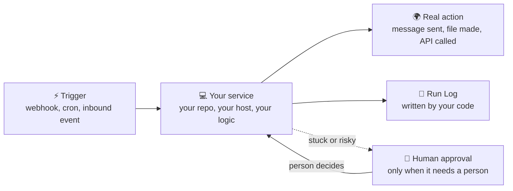

# Theme: Notion Track — Complete Problem Statement and Conversation

> **Purpose:** This document preserves the full problem statement shared by the user and the complete explanation/conversation that followed, from the beginning through the final explanation. No substantive line or section from the provided problem statement or the assistant explanations has been intentionally removed.

---

# 1. Original Problem Statement — Theme: Notion Track

## Implemented Project Feature Update

The resulting AutoDesk Engine applies this brief to a working college certificate workflow. It now has a landing-page submission modal, a `/dashboard` tactical simulator, Gemini classification with local fallback, MD5 duplicate filtering, Notion request and run-log records, confidence/attendance-based auto-routing, operator approve/reject actions, standalone HTML certificate generation, and Resend/Gmail SMTP delivery. The live pipeline API actions are `ingest`, `approve`, and `reject`.

## 1. The Problem

Every college, club, shop, and small agency in India has three or four jobs a person redoes by hand every week. Attendance registers. Requests dying in a WhatsApp group. Form responses copied into a sheet. A follow-up nobody sent. A PDF forwarded to seven people so one of them can retype it.

None of it is hard to automate. It just never got built, because the people doing the job cannot code and the people who can code never see the job. Off-the-shelf tools do not fit, because the job is specific to that college, that shop, that team.

You are not fixing India in a week. You are killing one of those jobs properly and leaving behind a running service plus a workspace the humans can operate after you are gone.

## 2. What You Are Building

Build a service that automates one real job, with Notion as its interface.

Think of it like this:

Your code is the engine. Notion is the interface. A trigger fires, your code does the work, a real action happens in the outside world, and a row lands in the Run Log. The human never runs anything. They read what happened, approve what matters, and override what is wrong.

### The three things your system must do

It runs without you. A webhook, a cron, or an inbound event fires it, on something you deployed. Running a script by hand during your demo is not a running service.

Humans approve the decisions that matter, inside Notion. At least one point in your workflow pauses and waits for a person to approve, reject, or override before the action fires.

It leaves proof. Every run writes a row to the Run Log with a real timestamp, written by your code. Rows spread across the event, not sixty rows created the night before demo day.

### What you are NOT building

A Zapier chain with a Notion page sitting on top of it. If the interesting part of your system lives inside a no-code canvas, you are in the wrong track.

A chatbot. Chat is a doorway, not a system.

A dashboard full of charts with no engine behind it.

A React app that treats Notion as a database and gives the human nothing. A person has to be able to do their whole part of the job inside Notion.

Five shallow features. One job killed cleanly beats five half-wired ideas.

> 🔪 **The test that kills the shortcut:** delete your repo. Does the system still work?
>
> If yes, you did not build anything. You wired up a no-code tool and put a Notion page on top. That does not score.

## 3. How the System Flows

Any stack, any framework. The shape below is the reference, not a requirement.



Three ideas to internalize from this diagram:

The engine is your code. The logic that decides what happens lives in a repo you can show us. Your code talks to Notion through the API or the MCP server, with your own integration token.

Notion is the interface, not the middleware. It is where the data lives, where humans approve, and where every run gets logged. Do not route every step through it.

The action happens outside Notion. A message sent, a file made, an API called. If nothing changes in the real world, you built a dashboard.

## 4. Where AI Actually Earns Its Place

AI handles what rules cannot: reading messy input, sorting it, drafting the action. Your code is the one calling it. An AI property inside a Notion database is not an engine.

### Earns it

A form arrives as one messy paragraph. AI reads it, pulls out the fields, sets a priority, routes it to the right owner.

Incoming requests in three languages get understood and categorised without a lookup table.

The system drafts the reply, a human approves it in Notion, then it sends.

### Does not earn it

AI writes a summary nobody reads.

A chatbot that answers questions about a database you could have just looked at.

AI generating text to fill a page so the workspace looks busy.

**Rule of thumb: if an if statement could have done it, an if statement should have done it.**

## 5. Notion's Role (read this twice, you are judged on it)

> ⭐ **Notion is the database, the control panel, and the audit trail.**
>
> Your service can run anywhere and use any stack. But everything a human needs to see, approve, or override lives in Notion. A person who has never seen your code should be able to open the workspace and know what the system does, what it did today, and what it is waiting on.

### The test judges will apply

Turn your service off. Is the Notion workspace still a useful place to run this job?

If your workspace is a dump of JSON-looking rows nobody would read, the answer is no. If it is a clean, human-readable operations hub that your code happens to maintain, the answer is yes. Build for yes.

### Common Notion mistakes (avoid these)

Writing raw model output into pages. Format for humans: clear titles, statuses, short reasoning summaries.

Faking the Run Log by hand. Rows written by your integration are attributed differently from rows you type. We check.

Building the Notion layer in the last two hours. It is a judging pillar, design it on day one.

## 6. End Goals

By the end of the event, your project should achieve:

One job, fully automated. A trigger fires, your code does the work, a real action happens outside Notion, and a row lands in the Run Log. No human in the middle.

A workspace a stranger can run the job from. Someone who has never seen your code opens Notion and knows what happened, what is pending, and what needs them.

A system that survives bad input. Garbage in, no crash, no duplicates, nothing silently lost. Anything it cannot handle goes to a human instead of disappearing.

Proof you built it across the event. Commits and Run Log rows spread over the days, not one night.

A durable design. Ask yourselves: who notices when the system makes a bad call? If the answer is "the person reading the Notion workspace," you built the right thing.

## 7. Your Stack and Your Setup

Any stack. Python, TypeScript, Go, or whatever you already write in. We score what your system does and how well it is built, not what it is written in.

Free to build. Everything runs on Notion's free plan plus free hosting tiers.

Students get free Notion Education Plus at notion.com/students, set up during the opening session.

Come with a boring job in mind. The best ones come from your own week.

---

# 2. First Explanation of the Theme

Simple language mein: **ye theme tumse ek “real working automation service” banwane ko keh rahi hai — sirf website, chatbot, dashboard, ya Notion database nahi.**

## 🎯 Core Idea

Tumhe kisi **real repetitive job** ko choose karna hai aur usse automate karna hai.

Example:

> "College club mein event registration ke baad volunteers manually students ko messages bhejte hain aur follow-up karte hain."

Tumhara project us boring repetitive job ko automate kare.

### System kuch aisa hoga:

```text
Trigger
   ↓
Tumhara Code / Backend
   ↓
AI / Logic
   ↓
Real Action
   ↓
Notion Run Log

Agar risky decision hai
   ↓
Human Approval in Notion
   ↓
Final Action
```

---

# 1. Sabse pehle: Problem choose karo

Tumhe **India ki koi huge problem solve nahi karni**.

Bas ek boring repetitive task choose karo jo log baar-baar manually karte hain.

### Examples:

- College attendance manually maintain karna
- WhatsApp par requests lose ho jana
- Google Form responses manually Excel mein copy karna
- Event participants ko follow-up messages bhejna
- PDFs se information manually extract karna
- Leave requests manage karna
- Club registrations verify karna
- Certificates manually generate karna

**Important:** 5 half-baked features se better hai **ek complete job automate karna**.

---

# 2. Notion tumhari website nahi hai — tumhara Control Center hai

Is theme mein Notion ko 3 roles dene hain:

### 🗄️ 1. Database

Saari important information Notion mein store hogi.

### 🎛️ 2. Control Panel

Human Notion ke andar:

- Pending requests dekhega
- Approve karega
- Reject karega
- Override karega

### 📜 3. Audit / Run Log

Har baar system run hone par automatically ek entry create honi chahiye.

Example:

| Time | Task | Status | Action |
|---|---|---|---|
| 10:31 AM | Student Request #24 | Completed | Email Sent |
| 10:35 AM | Request #25 | Waiting Approval | — |
| 10:40 AM | Request #26 | Failed | Sent to Human |

⚠️ Ye entries tum manually nahi bana sakte.

**Tumhara code Notion API se automatically create karega.**

---

# 3. Tumhara actual code zaroori hai

Judges basically ye check karenge:

> **"Agar GitHub repository delete kar dein, kya system phir bhi kaam karega?"**

Agar answer **Yes** hai, toh tumne mostly no-code automation use ki hai.

Example:

```text
Google Form
   ↓
Zapier
   ↓
Notion
   ↓
Email
```

❌ Ye strong project nahi maana jayega.

Instead:

```text
Google Form/Webhook
        ↓
Your Backend Code
(Node.js / Python etc.)
        ↓
AI / Your Logic
        ↓
Notion API
        ↓
Email / WhatsApp / PDF / Other Action
```

✅ Ye expected architecture hai.

---

# 4. System automatically run hona chahiye

Tum demo ke time terminal kholkar:

```bash
python app.py
```

chalaoge...

❌ Then that's not a running service.

System ko automatically trigger hona chahiye.

### Valid triggers:

- Webhook
- Cron Job
- Scheduled task
- Form submission
- Incoming email
- API event

Example:

```text
New Form Submitted
        ↓
Webhook fires
        ↓
Your deployed backend wakes up
        ↓
Processes request
```

Tumhe manually button dabakar ya script run karke system start nahi karna chahiye.

---

# 5. Real-world action hona chahiye

Sirf data ko Notion mein dikhana enough nahi hai.

System ko **outside world mein kuch actual action** karna chahiye.

### Examples:

📧 Email send kare

📄 PDF generate kare

📱 Message send kare

🔗 API call kare

📅 Calendar event create kare

📂 File organize kare

For example:

```text
Student submits certificate request
        ↓
System checks data
        ↓
AI extracts information
        ↓
Human approves in Notion
        ↓
PDF certificate generated
        ↓
Email automatically sent
        ↓
Run logged in Notion
```

That's a proper system.

---

# 6. Human approval compulsory hai

At least **ek important point par system ko rukna chahiye**.

Example:

AI ne email draft kiya:

> "Your request has been approved..."

Lekin automatically send nahi karega.

Notion mein status hoga:

```text
Pending Approval
```

Human Notion kholega:

```text
Approve
Reject
Override
```

Agar approve:

```text
Notion Approval
      ↓
Your backend detects change
      ↓
Email sent
      ↓
Run Log updated
```

Ye part important hai because theme ka idea hai:

> **Automation should work automatically, but humans should control important decisions.**

---

# 7. AI use karna compulsory-looking nahi, useful hona chahiye

AI sirf project ko fancy dikhane ke liye mat use karna.

### ❌ Weak AI use

```text
AI → Generates summary
```

Aur koi us summary ko use hi nahi karta.

Ya:

```text
AI chatbot
```

Jo sirf database ke baare mein questions answer karta hai.

### ✅ Good AI use

Suppose input:

> "Sir mujhe kal ke event ke liye registration cancel karna hai because my exams got shifted and I won't be able to attend..."

AI extract kare:

```json
{
  "intent": "Registration Cancellation",
  "priority": "Medium",
  "person": "Abhishek",
  "department": "Event Management"
}
```

Phir tumhara backend decide kare:

```text
Cancellation Request
        ↓
AI understands messy text
        ↓
Backend validates
        ↓
Notion Approval
        ↓
Registration cancelled
        ↓
Confirmation email sent
```

Yahan AI actually useful hai.

---

# 8. Important rule: if statement vs AI

Theme ne clearly bola hai:

> **If an if statement can do it, use an if statement.**

Example:

```javascript
if (marks >= 40) {
   status = "Pass";
}
```

Iske liye AI call karna stupidity hai.

AI use karo jab:

- Input messy ho
- Multiple languages ho
- Text samajhna ho
- Classification difficult ho
- Draft generate karna ho

---

# 9. Bad input handle karna hoga

Tumhara system perfect input assume nahi kar sakta.

Example:

```text
Name: Abhi
Phone: abc123
Email: something
```

System crash nahi hona chahiye.

Instead:

```text
Invalid Input
      ↓
Send to Human Review in Notion
      ↓
Human fixes / overrides
      ↓
System continues
```

Also duplicate requests handle karne honge.

```text
Same form submitted twice
```

System should ideally detect:

```text
Duplicate Request Detected
```

Not perform the action twice.

---

# 🔥 Ek Complete Example

Tumhare profile aur projects ko dekhte hue, ek strong idea ho sakta hai:

## **College Event Follow-Up Automation System**

### Problem:

College communities/hackathons mein registrations hoti hain, but organizers manually:

- Registrations check karte hain
- Invalid entries filter karte hain
- Follow-up bhejte hain
- Important participants identify karte hain
- Reminders bhejte hain

Ye boring manual job hai.

### Tumhara system:

```text
Google Form / Custom Form
          ↓
Webhook
          ↓
Your Node.js / Python Service
          ↓
Validate Input
          ↓
AI analyzes messy responses
          ↓
Categorize Participant
          ↓
Notion Database
          ↓
Human checks risky cases
          ↓
Approve / Reject
          ↓
Email / Message Sent
          ↓
Notion Run Log
```

### Notion Workspace:

```text
📥 Incoming Requests

⏳ Pending Approval

⚠️ Needs Human Review

✅ Completed Actions

📜 Run Log
```

### Run Log automatically:

```text
Run #102
Time: Aug 20, 2026 – 7:15 PM
Trigger: New Registration
Action: Confirmation Email Sent
Status: Success
```

---

# 🏆 Judges basically kya dekhेंगे?

| Requirement | Meaning |
|---|---|
| Real problem | Actual boring job |
| Your code | Main logic tumhare repo mein |
| Automation | Automatically trigger |
| Notion | Human workspace |
| Human approval | At least one decision |
| Real action | Email/PDF/API/message etc. |
| Run Log | Automatically written |
| AI | Only where actually useful |
| Error handling | Bad input shouldn't kill system |
| Proof | Git commits + logs spread across event |

---

## Brutally honest summary

Agar tum:

> **"Ek beautiful React dashboard + AI chatbot + Notion database"**

banaoge, toh **theme ko fundamentally miss kar doge**.

Agar tum:

> **"Ek ugly but reliable backend service jo real repetitive job ko automatically complete karta hai, Notion mein humans ko control deta hai, aur every action ka proof log karta hai"**

banaoge, toh tum theme ko actually understand kar rahe ho.

### One-line formula:

> **Trigger → Your Code → AI/Logic → Human Approval if needed → Real Action → Notion Run Log**

---

# 3. Follow-up Conversation

**User:** ok

**Assistant:** Cool. Then the smart next step is **not to jump into coding**.

First, choose the **one boring job worth killing**.

I’d suggest we evaluate 5 ideas based on:

- Real problem
- Automation depth
- AI usefulness
- Notion integration
- Easy demo
- Free-tier feasibility
- Hackathon winning potential

Then pick **one** and build the complete system architecture around it.

Say **“give me 5 ideas”** and I’ll shortlist them brutally instead of throwing generic chatbot ideas at you.

---

# 4. Detailed Explanation — Notion Solver / Notion-based Automation System

हाँ — इसे **एक ही complete idea की तरह**, detail में समझते हैं: **Notion Solver / Notion-based Automation System actually कैसे बनाना है**.

# 🧠 सबसे पहले पूरा concept समझो

मान लो तुम्हारे college, community, club या small business में रोज़ ऐसी requests आती हैं:

> "Sir मेरा certificate नहीं मिला। मैंने event attend किया था। Please check कर दीजिए।"

या:

> "मैं hackathon में register हुआ था लेकिन confirmation नहीं आया।"

या:

> "मेरी attendance गलत mark हो गई है।"

अभी normally क्या होता है?

```text
Student
   ↓
WhatsApp Message
   ↓
Admin message देखता है
   ↓
Details manually पूछता है
   ↓
Excel/Sheet check करता है
   ↓
Correct person को forward करता है
   ↓
Follow-up करता है
   ↓
Reply करता है
```

यही **boring repetitive job** है।

अब हम इसे automate करेंगे।

---

# 🚀 हमारा Project: Notion Solver

## Problem Statement

**College/Community Request Automation System**

Users अपनी problem या request submit करेंगे।

System automatically:

1. Request receive करेगा
2. Input समझेगा
3. AI से request classify करेगा
4. सही category/priority लगाएगा
5. Notion में human-readable request बनाएगा
6. Risky requests को human approval के लिए भेजेगा
7. Approval के बाद real-world action करेगा
8. हर action का Run Log बनाएगा

---

# 🔥 पूरा System Architecture

```text
                 USER
                   │
                   ▼
          Request Form / Webhook
                   │
                   ▼
        ┌─────────────────────┐
        │   YOUR BACKEND      │
        │ Node.js / Python    │
        │                     │
        │ Validation          │
        │ Duplicate Check     │
        │ Business Logic      │
        └──────────┬──────────┘
                   │
                   ▼
              AI ANALYSIS
                   │
          ┌────────┴────────┐
          │                 │
          ▼                 ▼
     Simple Request     Risky Request
          │                 │
          ▼                 ▼
    Auto Processing      NOTION
                            │
                            ▼
                     Human Approval
                      /     |      \
                 Approve  Reject  Override
                     │
                     ▼
                YOUR BACKEND
                     │
                     ▼
                 REAL ACTION
              Email/PDF/API/etc.
                     │
                     ▼
                 NOTION
                  RUN LOG
```

अब इसे एक-एक करके समझते हैं।

---

# 1️⃣ USER REQUEST भेजता है

तुम एक simple form बना सकते हो।

Example:

```text
Name:
Email:
Request:

"मैंने AI Workshop attend किया था लेकिन certificate नहीं मिला।
मैंने registration किया था और event भी attend किया था।"
```

User Submit करता है।

अब form directly backend को भेजेगा।

```text
POST /api/request
```

मतलब:

```text
User
 ↓
Frontend Form
 ↓
Webhook/API
 ↓
Your Server
```

यहाँ से तुम्हारा actual system शुरू होता है।

---

# 2️⃣ YOUR BACKEND — असली Engine

यही सबसे important हिस्सा है।

तुम्हारा backend:

```text
Node.js + Express
```

या:

```text
Python + FastAPI
```

हो सकता है।

Backend सबसे पहले input validate करेगा।

Example:

```javascript
if (!email) {
   return "Invalid Request";
}
```

फिर check करेगा:

- Request empty तो नहीं?
- Email valid है?
- Duplicate request तो नहीं?
- Same user ने 5 बार submit तो नहीं किया?

अगर input खराब है:

```text
Bad Input
   ↓
Notion → Needs Human Review
```

System crash नहीं होना चाहिए।

---

# 3️⃣ AI का Actual काम

अब AI request पढ़ेगा।

User ने लिखा:

> "Bhai मैंने event attend किया था but certificate अभी तक नहीं आया, please check."

AI इसे structured data में convert करेगा:

```json
{
  "category": "Certificate Issue",
  "priority": "Medium",
  "sentiment": "Frustrated",
  "recommended_action": "Check attendance and certificate record"
}
```

यही AI का सही use है।

क्योंकि user अलग-अलग तरीके से लिख सकता है:

```text
certificate nahi mila
```

या:

```text
I haven't received my certificate.
```

या:

```text
मेरे को प्रमाण पत्र नहीं मिला।
```

Simple `if statement` हर messy language को properly handle नहीं करेगा।

इसलिए यहाँ AI useful है।

---

# 4️⃣ Request Notion में जाएगी

अब backend Notion API use करेगा।

मान लो तुम्हारे Notion में database है:

# 📥 Incoming Requests

| Request ID | User | Category | Priority | Status |
|---|---|---|---|---|
| #101 | Abhishek | Certificate | Medium | Pending |
| #102 | Rahul | Attendance | High | Review |

तुम्हारा code Notion API से automatically नया row बनाएगा।

मतलब human manually entry नहीं करेगा।

Flow:

```text
Backend
   ↓
Notion API
   ↓
New Database Page
```

Example properties:

```text
Request ID: REQ-101
Name: Abhishek
Email: example@email.com
Category: Certificate Issue
Priority: Medium
Status: Pending Review
AI Summary:
"User attended the event but hasn't received certificate."
```

अब admin Notion खोलकर सब कुछ easily समझ सकता है।

---

# ⭐ यहाँ Notion का Real Role शुरू होता है

Notion सिर्फ database नहीं है।

यह पूरा **Human Control Center** है।

तुम्हारे workspace में multiple databases/views हो सकते हैं।

## 📥 1. Incoming Requests

सारी new requests।

```text
New
Processing
Needs Review
Approved
Rejected
Completed
```

---

## ⚠️ 2. Needs Human Approval

यह filter view होगा।

Only ऐसी requests:

```text
Status = Needs Approval
```

Admin Notion खोलते ही देख सकता है:

> आज system किस decision का इंतजार कर रहा है?

Example:

```text
Request #104

Issue:
Certificate missing

AI Recommendation:
Verify attendance and send certificate.

Confidence:
72%

Status:
🟡 WAITING FOR APPROVAL
```

Admin के पास options:

```text
Approve
Reject
Override
```

---

# 5️⃣ Human Approval कैसे काम करेगा?

यह सबसे tricky और important integration है।

मान लो admin Notion में:

```text
Status → Approved
```

करता है।

अब तुम्हारे backend को पता चलना चाहिए।

### तरीका:

तुम periodic polling या suitable event/webhook architecture use कर सकते हो।

Example:

```text
Every 1 minute
      ↓
Backend checks Notion
      ↓
Find:
Status = Approved
      ↓
Process request
```

तुम्हारा service check करेगा:

```text
"क्या कोई Approved request है?"
```

अगर है:

```text
Approved
   ↓
Backend receives it
   ↓
Performs action
```

---

# 6️⃣ Real Action होना चाहिए

यहीं बहुत projects fail होंगे।

अगर तुम सिर्फ:

```text
Form
 ↓
Notion
```

बनाते हो...

तो यह automation system नहीं है।

कुछ **outside Notion** होना चाहिए।

हमारे project में:

### Certificate Issue

```text
Human Approved
       ↓
Backend verifies details
       ↓
Certificate generated
       ↓
PDF created
       ↓
Email sent to student
```

अब real world में actual action हुआ।

Example email:

```text
Subject: Your Certificate is Ready 🎉

Hi Abhishek,

Your certificate request has been approved.

Your certificate is attached.

Regards,
Event Team
```

अब user को genuinely benefit मिला।

---

# 7️⃣ Run Log — Proof कि System चला

हर बार कोई action होगा, backend Notion में automatically log बनाएगा।

Database:

# 📜 Run Log

| Run ID | Time | Trigger | Action | Status |
|---|---|---|---|---|
| RUN-001 | 10:30 | New Request | AI Classified | Success |
| RUN-002 | 10:35 | Approval | Certificate Generated | Success |
| RUN-003 | 10:36 | Approval | Email Sent | Success |

Important:

❌ तुम manually rows नहीं बनाओगे।

तुम्हारा code लिखेगा।

Example:

```text
Backend
   ↓
Action completed
   ↓
Notion API
   ↓
Create Run Log
```

इससे judges को पता चलेगा कि system सच में चला है।

---

# 🔄 पूरा Workflow एक Real Example से

चलो Abhishek की request लेते हैं।

## Step 1 — User submits

```text
Name: Abhishek

Message:
"I attended the AI workshop but I haven't received
my certificate yet. Can you please check?"
```

↓

## Step 2 — Trigger

Form submit होते ही:

```text
POST /api/request
```

↓

## Step 3 — Backend validation

```text
✓ Name exists
✓ Email exists
✓ Request exists
✓ Not duplicate
```

↓

## Step 4 — AI Analysis

AI:

```text
Category:
Certificate Issue

Priority:
Medium

Recommended Action:
Verify attendance before sending certificate.
```

↓

## Step 5 — Notion Entry

Notion:

```text
REQ-101

User: Abhishek

Issue:
Certificate Missing

Priority:
Medium

Status:
Waiting Approval
```

↓

## Step 6 — Human opens Notion

Admin देखता है:

```text
AI Recommendation:
Verify attendance and send certificate.
```

Admin:

```text
Status → APPROVED
```

↓

## Step 7 — Backend detects approval

```text
Notion
 ↓
Status changed
 ↓
Backend detects Approved
```

↓

## Step 8 — Real Action

Backend:

```text
Generate Certificate
        ↓
Create PDF
        ↓
Send Email
```

↓

## Step 9 — Update Notion

Request status:

```text
COMPLETED ✅
```

↓

## Step 10 — Run Log

```text
RUN-101

Timestamp:
20 Aug 2026 – 8:15 PM

Trigger:
Notion Approval

Action:
Certificate Generated + Email Sent

Status:
SUCCESS
```

---

# 🗂️ Recommended Notion Structure

तुम्हारा Notion workspace कुछ ऐसा होना चाहिए:

```text
🏠 NOTION SOLVER HQ
│
├── 📥 Requests
│      ├── New
│      ├── Processing
│      ├── Needs Review
│      ├── Approved
│      └── Completed
│
├── ⚠️ Human Approval Queue
│
├── 📜 Run Log
│
├── 🚨 Failed Jobs
│
└── 📊 System Overview
```

लेकिन ध्यान रखना:

**Dashboard सिर्फ decoration नहीं होना चाहिए।**

हर चीज़ useful होनी चाहिए।

जब कोई admin खोले, उसे immediately समझ आना चाहिए:

```text
आज कितनी requests आईं?

कितनी pending हैं?

किस चीज़ को approval चाहिए?

कौन सा job fail हुआ?

क्या system successfully run कर रहा है?
```

---

# 🔌 Notion Integration practically क्या है?

तुम्हें Notion में एक integration बनानी होगी।

Flow:

```text
Your Backend
      │
      │ Notion API
      ▼
Notion Workspace
      │
      ▼
Databases
```

तुम्हारा backend Notion से:

### READ करेगा

```text
Approved Requests
```

### CREATE करेगा

```text
New Request
Run Log
Failed Job
```

### UPDATE करेगा

```text
Status
Action Result
Error
Completion Time
```

मतलब Notion और backend दोनों connected होंगे।

लेकिन important point:

> **Notion को middleware मत बनाना।**

Wrong:

```text
Trigger
 ↓
Notion
 ↓
Zapier
 ↓
Another Tool
 ↓
Email
```

Better:

```text
Trigger
 ↓
YOUR CODE
 ↓
Notion API + AI + External Service
```

तुम्हारा backend central brain है।

---

# 💻 Recommended Tech Stack

तुम्हारे लिए मैं unnecessarily complex stack recommend नहीं करूंगा।

## Frontend

```text
HTML
CSS
JavaScript
```

या simple:

```text
React + Vite
```

लेकिन frontend main product नहीं है।

---

## Backend

मैं recommend करूंगा:

```text
Node.js
Express
```

क्योंकि तुम JavaScript already use करते हो।

---

## AI

```text
Gemini API
```

Use for:

- Request classification
- Extracting information
- Priority detection
- Draft generation

---

## Database

Hackathon MVP के लिए:

```text
Notion Database
```

अगर duplicate detection और reliability चाहिए:

```text
Supabase / MongoDB
```

लेकिन core human-facing data Notion में रहना चाहिए।

---

## Automation

```text
Webhook
+
Cron Job
```

Example:

```text
Form Submission → Webhook

Every 1 minute → Check Notion Approvals
```

---

## External Action

Start simple:

```text
Email Sending
```

Then optionally:

```text
PDF Generation
```

---

# 🏗️ Final Architecture

```text
                    ┌───────────────┐
                    │ USER FORM     │
                    └───────┬───────┘
                            │
                         Webhook
                            │
                            ▼
              ┌────────────────────────┐
              │ YOUR NODE.JS SERVICE   │
              │                        │
              │ • Validation           │
              │ • Duplicate Detection  │
              │ • AI Processing        │
              │ • Business Logic       │
              └───────────┬────────────┘
                          │
                ┌─────────┴─────────┐
                │                   │
                ▼                   ▼
          ┌──────────┐         ┌─────────┐
          │ Gemini AI│         │ Notion  │
          └──────────┘         └────┬────┘
                                    │
                             Human Approval
                                    │
                         Approved / Rejected
                                    │
                                    ▼
                         ┌─────────────────┐
                         │ YOUR SERVICE    │
                         └────────┬────────┘
                                  │
                         ┌────────┴────────┐
                         │                 │
                         ▼                 ▼
                    Email Sent        PDF Created
                         │                 │
                         └────────┬────────┘
                                  │
                                  ▼
                              NOTION
                              RUN LOG
```

# 🏆 सबसे important बात

इस पूरे project का goal **"AI-powered request management dashboard" बनाना नहीं है**।

वो boring और common hackathon project होगा।

असल goal है:

> **एक इंसान का repetitive काम पकड़ो → तुम्हारा code उसे automatically करे → जहां risky decision हो वहां Notion में human को control दो → फिर real action करो → और हर चीज़ का proof Notion Run Log में रखो।**

अगर तुम इसे सही से build करते हो, तो तुम्हारा **Notion Solver** सिर्फ एक website नहीं होगा। यह एक actual **running automation service** होगा।

---

# Final One-Line Understanding

> **Trigger → Your Code → AI/Logic → Human Approval if needed → Real Action → Notion Run Log**

---

## End of Conversation Record
